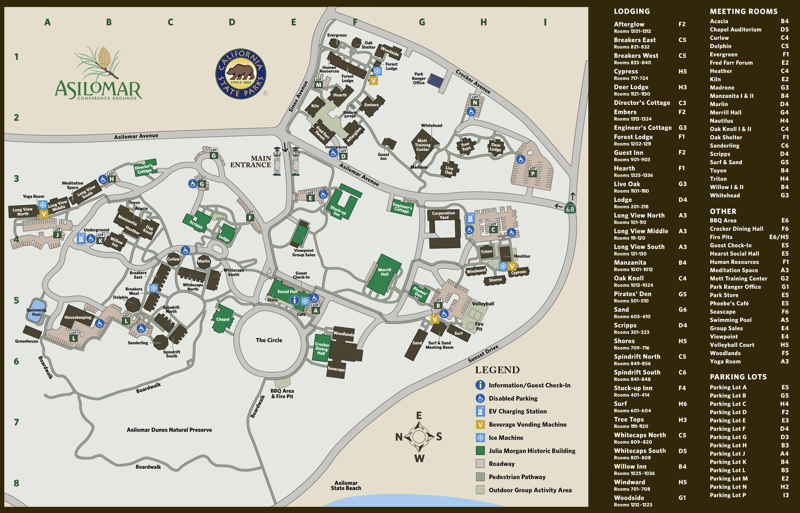

# Event Logistics

## WiFi Network

Check back later...

## Location

The 2025 ECCO Summer School will be held at the Asilomar Conference Center in Pacific Grove, California.

```
Asilomar Conference Grounds
800 Asilomar Ave
Pacific Grove, CA 93950
```

[Link on Google Maps](https://maps.app.goo.gl/68Vax6z26FZSuDsk7)

### Property Map


[Asilomar Property Map pdf](https://www.visitasilomar.com/media/822808/asilomar-grounds-map-20210611.pdf)

## Lodging 

Student housing is provided in double-occupancy rooms. We may be able to accomodate single occupancy upon request.

## Meals

* Breakfast, lunch, and dinner are provided at the [Crocker Dining Hall](https://www.visitasilomar.com/dining/crocker-dining-hall/).

_"The daily menu highlights fresh, seasonal, local produce procured directly from our network of regional, organic farmers. Each day menu boards are posted at the dining hall and front desk, showcasing the meal that will be offered for breakfast, lunch and dinner."_

* Light refreshments will be served in the morning and afternoon.

* Asilomar also has a small cafe on site, [Phoebe's Cafe](https://www.visitasilomar.com/dining/phoebes-cafe/) (Monday - Sunday 	7:00 am - 5:00 pm)

_"Sit back in the comfortable, antique setting of the Café and the Social Hall to enjoy coffee and tea creations, fresh baked goods, lunch specialties, or grab a Bite on the Go! Phoebe’s serves beer, wine, and spirits. Phoebe’s is proud to serve English Ales from our local Monterey brewery. Whether it’s a snack on the adjoining outdoor deck or a glass of wine and cheese platter by the roaring fire in the main hall, great moments begin in Phoebe’s Café."_

### Parking

Parking is free at Asilomar Hotel & Conference Grounds and there is no park entrance fee.

[Parking Map](https://www.visitasilomar.com/plan/maps-parking/)

### Getting There

Monterey Regional Airport is the closest airport to Asilomar Hotel & Conference Grounds.

## Program

* Doors open at 8:30 am each morning (Monday-Friday). Morning sessions start 9:00 a.m.
* Due to space limitations, only registered participants will be allowed to attend.
* Participants are expected to attend all scheduled activities. Contact {{ contact_email }} if any circumstances prevent you from attending.